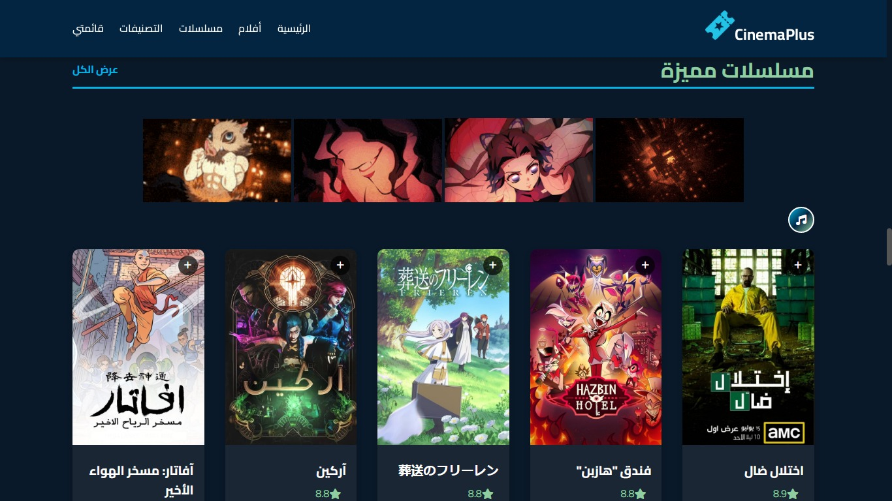
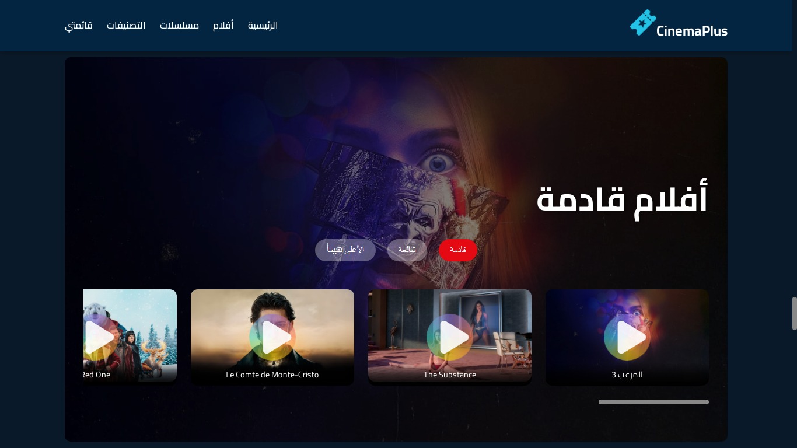
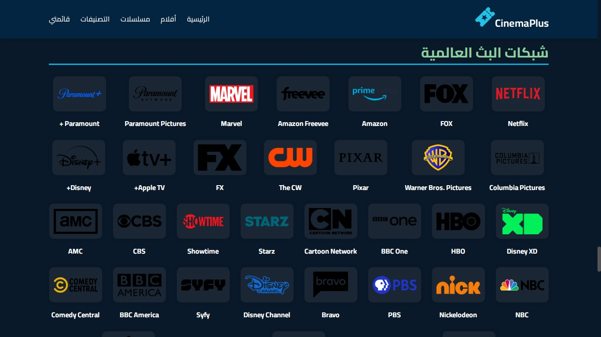
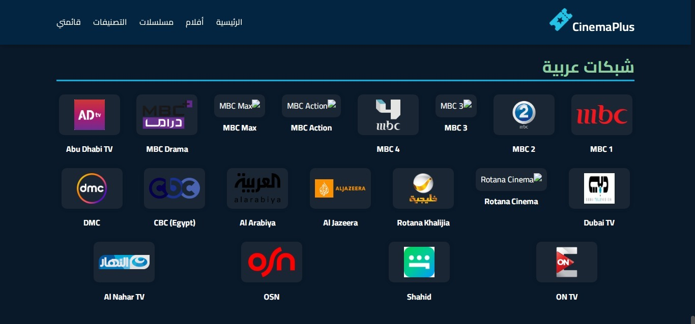
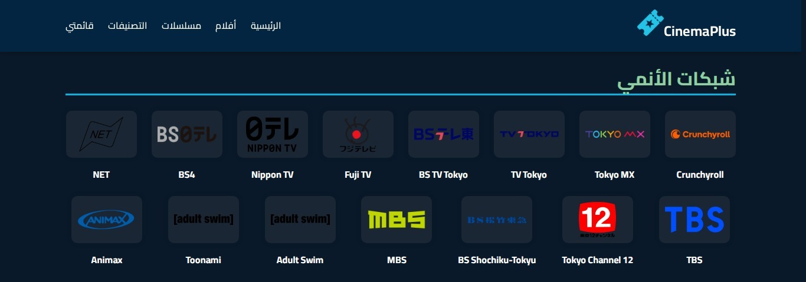
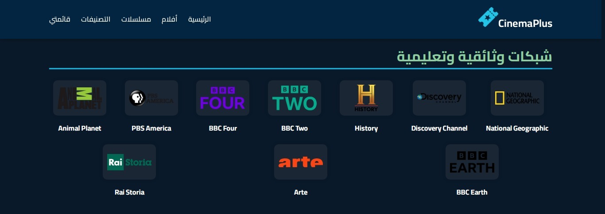
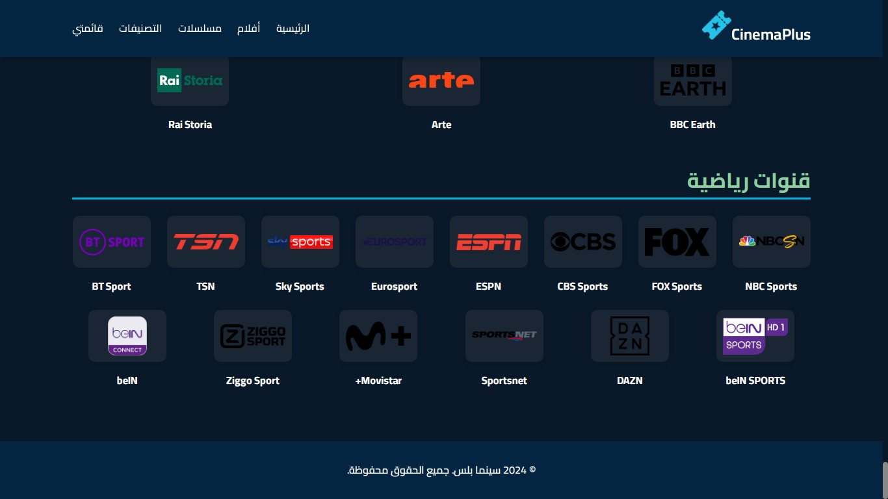
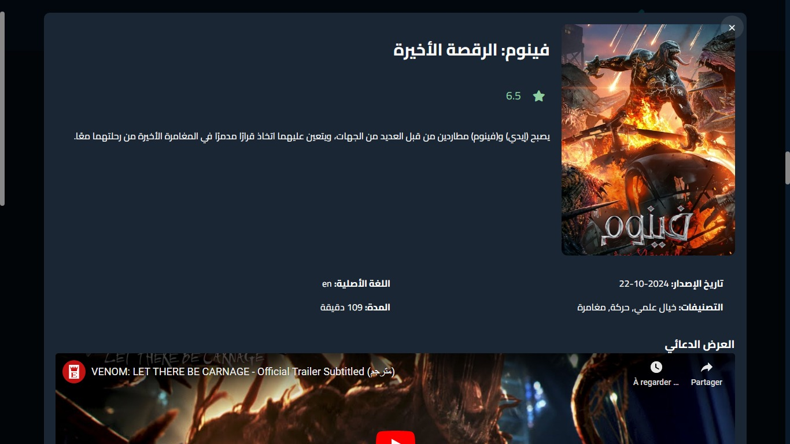
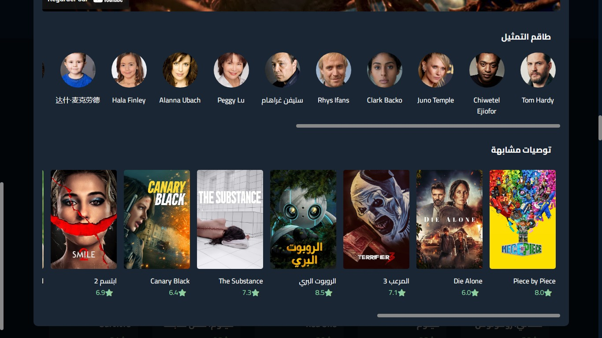
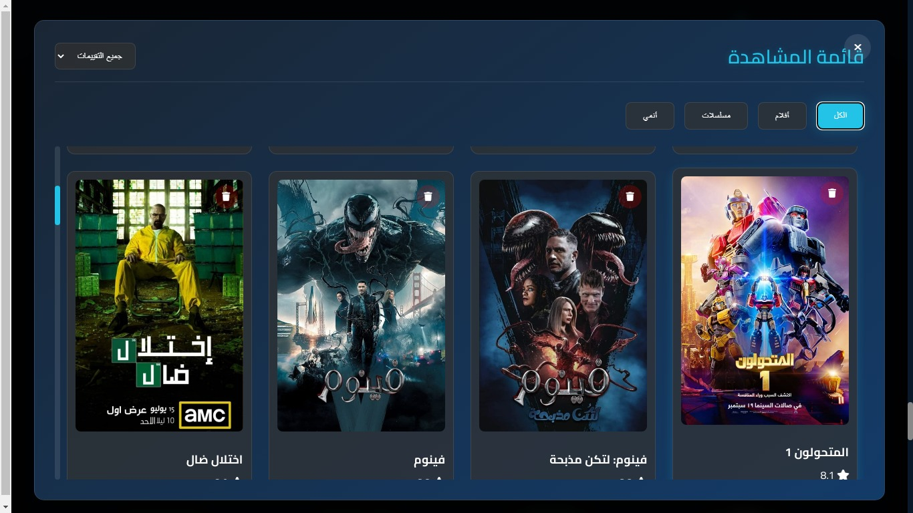

# SMCinema

*SMCinema* is a specialized web platform for streaming a wide range of movies, series, anime, sports channels, global and Arabic channels, as well as educational and documentary networks. Built with modern web technologies like HTML, CSS, and JavaScript, it utilizes the *TMDB API* to fetch movie and content data dynamically.

## Features

- *Wide Collection of Movies*: Browse through movies of various genres.
- *Diverse Series Library*: Access both global and Arabic series.
- *Anime Section*: Watch your favorite anime with regular updates.
- *Live Sports Channels*: Stay updated with live matches and sports events.
- *Streaming Channels*: Access global and Arabic series and movie streaming channels.
- *Educational Networks*: Enjoy a variety of educational content for all ages.
- *Documentaries*: Explore a curated selection of documentaries on various topics.

## Technologies Used

- *HTML*: For the core structure of the website.
- *CSS*: To enhance design and styling.
- *JavaScript*: For dynamic interactions and functionalities.
- *TMDB API*: For fetching movies, series, and anime data.


## How to Use

1. *Clone the Repository*:
   Clone the project using Git:
   ```bash
   git clone https://github.com/MEDELBOU3/smcinema.git


2. Open the Project: Navigate to the project folder in your preferred code editor.


3. Run the Project: Open the index.html file in your browser to view the website.

## Screenshot Gallery

Explore screenshots from the SMCinema website below:

|  |  |
|---------------------------------------|-----------------------------------------|
| Home Page                           | Genres                               |

|  |  |
|-------------------------------------------|-----------------------------------------------|
| Most Popular                            | Popular Movies                             |

|  |  |
|-------------------------------------------|---------------------------------------------|
| Featured TV-shows                       | Upcoming Movies                          |

|  |  |
|--------------------------------------------------|--------------------------------------------------|
| Global Broadcast Networks                      | Arabic Networks                               |

|  |  |
|--------------------------------------------------|---------------------------------------------------|
| Anime Networks                                 | Doc and Educational Networks                    |

|  |  |
|--------------------------------------------------|------------------------------------------------|
| Sport Networks                                 | Movie Modal Display                           |

|  |  |
|----------------------------------------------------|---------------------------------------------|
| Recommendation and Cast Modal                    | Playlist with Filter                      |
